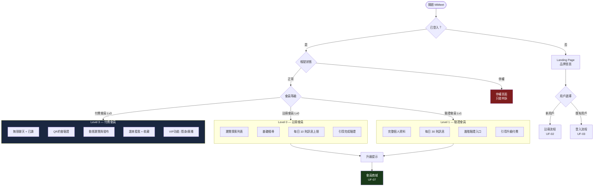
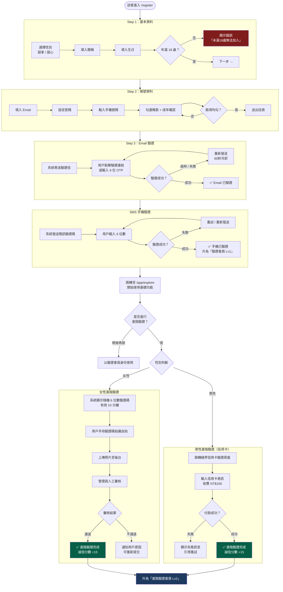
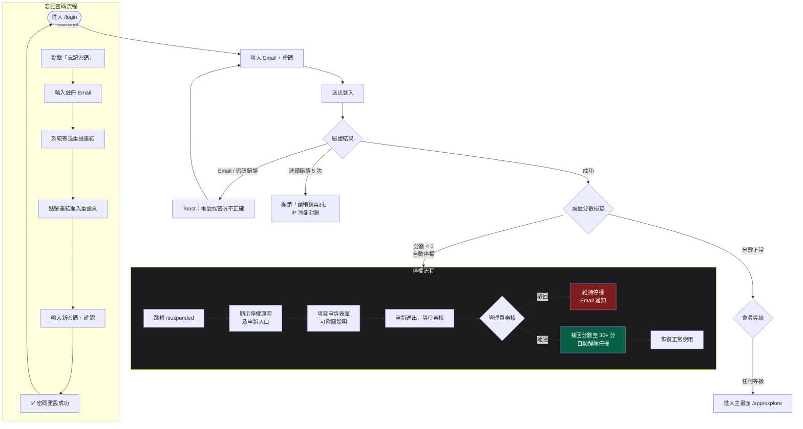
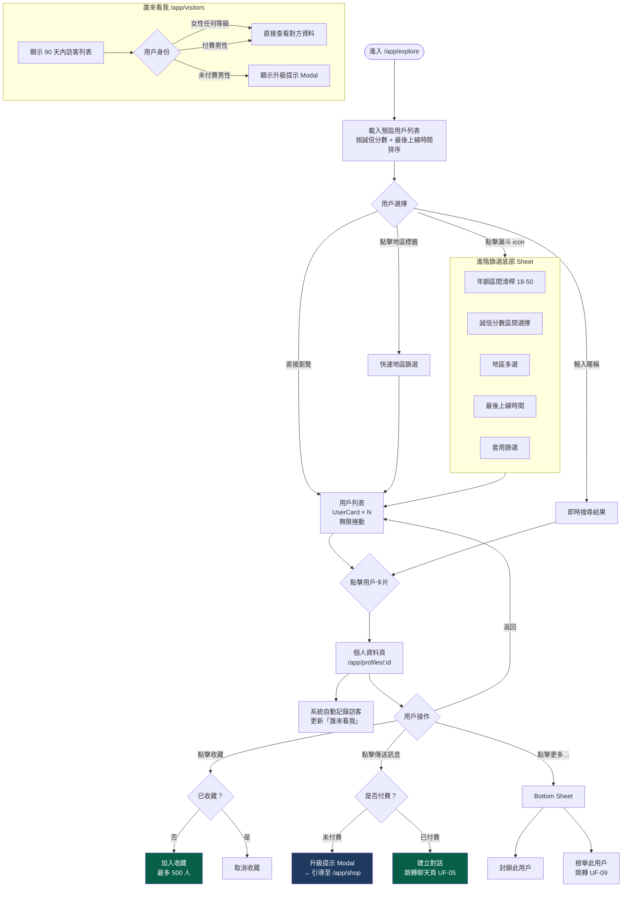
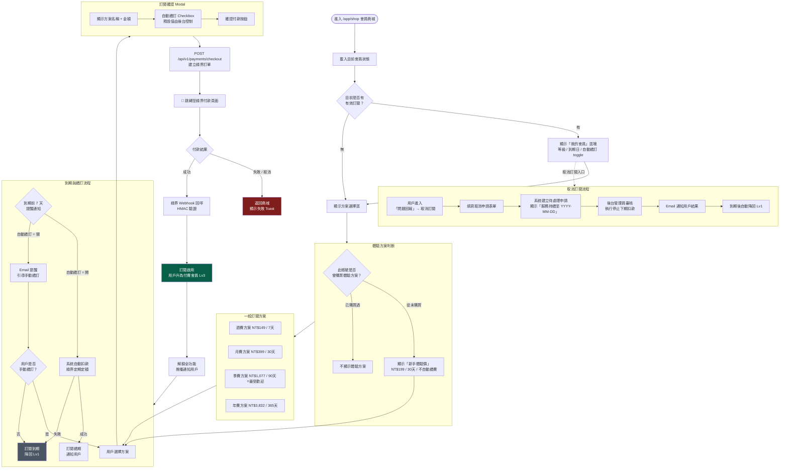
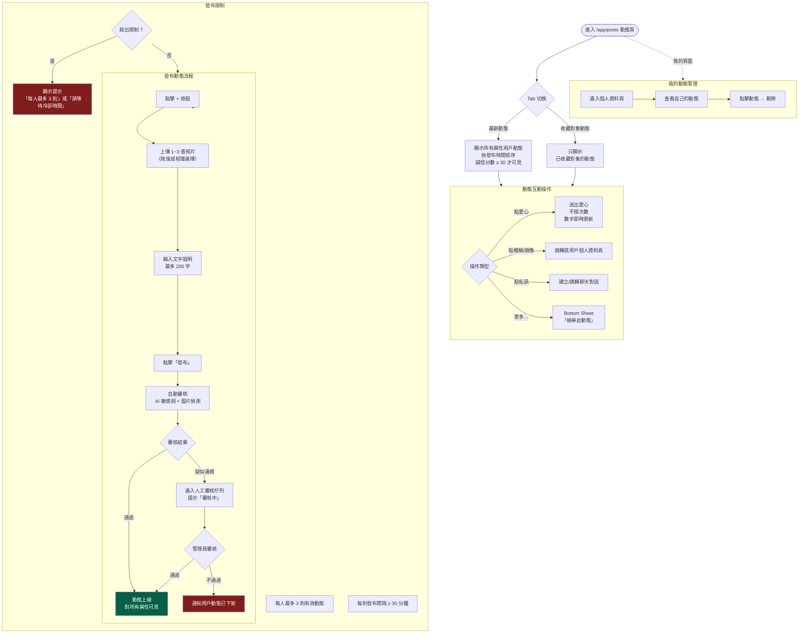

# [UF-001] MiMeet 用戶流程圖（User Flow）

**文檔版本：** v1.0  
**建立日期：** 2026年3月  
**適用範圍：** 前台用戶完整使用流程 + 後台管理員流程  
**參考文件：** PRD-001、UI-001、API-001、API-003

---

## 總覽索引

| # | 流程名稱 | 涵蓋範圍 |
|---|---------|---------|
| UF-01 | 主用戶旅程總覽 | 所有用戶角色的高層次路徑 |
| UF-02 | 註冊與分層驗證流程 | 基礎註冊 → Email → SMS → 進階驗證 |
| UF-03 | 登入與帳號狀態處理 | 登入、停權檢查、申訴 |
| UF-04 | 搜尋與探索流程 | 搜尋、篩選、查看資料頁、收藏 |
| UF-05 | 聊天與即時訊息流程 | 發起對話、傳訊、權限限制 |
| UF-06 | QR碼約會驗證流程 | 邀請、接受、掃碼、分數獎勵 |
| UF-07 | 訂閱付費流程 | 方案選擇、綠界付款、到期管理 |
| UF-08 | 社群動態流程 | 發布動態、點愛心、收藏對象動態 |
| UF-09 | 安全與回報流程 | 封鎖、檢舉、問題回報、申訴 |
| UF-10 | 後台管理員流程 | 用戶管理、審核、系統設定 |

---

## UF-01 主用戶旅程總覽

> **說明：** 展示三類主要用戶角色（未登入訪客、已登入一般用戶、付費會員）的關鍵路徑分支。



---

## UF-02 註冊與分層驗證流程

> **說明：** 涵蓋三步驟註冊 → Email 驗證 → 手機 SMS 驗證 → 進階驗證（依性別分流）。



---

## UF-03 登入與帳號狀態處理

> **說明：** 登入後的狀態分叉，含停權判斷、申訴流程、忘記密碼。



---

## UF-04 搜尋與探索流程

> **說明：** 用戶如何探索、篩選並查看其他用戶資料，包含誠信分數限制與收藏互動。



---

## UF-05 聊天與即時訊息流程

> **說明：** 從開啟對話列表到傳訊，含訊息等級限制、已讀、QR 邀請入口。

```mermaid
flowchart TD
    ENTRY([進入 /app/messages 或從個人頁發起]) --> MSG_LIST[聊天列表\n依最新訊息時間排序]

    MSG_LIST --> SEARCH_CHAT[搜尋對話對象暱稱]
    MSG_LIST --> OPEN_CHAT{開啟對話}
    OPEN_CHAT -->|點擊 ChatCard| ROOM[對話頁面\n/app/messages/:id]
    OPEN_CHAT -->|從個人資料頁點傳訊| CREATE_CHECK

    subgraph CREATE_CHECK [建立對話前權限檢查]
        CC1{誠信分數是否\n允許發訊？}
        CC1 -->|自己分數低\n無法主動聯繫高分用戶| CC_BLOCK[顯示提示\n「您的誠信分數不足以\n主動聯繫此用戶」]
        CC1 -->|可以發訊| CC2{是否已有對話？}
        CC2 -->|是| ROOM
        CC2 -->|否| CREATE_CHAT[POST /api/v1/chats\n建立新對話]
        CREATE_CHAT --> ROOM
    end

    ROOM --> HISTORY[載入歷史訊息\n分頁載入]
    ROOM --> WS[WebSocket 連線建立\nprivate-chat.{user_id}]

    subgraph SEND_MSG [傳送訊息]
        SM1{訊息類型}
        SM1 -->|文字| SM2[輸入文字]
        SM1 -->|圖片| SM3[選擇圖片\n最大 5MB]
        SM1 -->|表情符號| SM4[開啟表情選擇器]
        SM2 --> QUOTA_CHECK
        SM3 --> QUOTA_CHECK
        SM4 --> QUOTA_CHECK

        subgraph QUOTA_CHECK [每日訊息配額檢查]
            QC1{會員等級}
            QC1 -->|Lv0 註冊會員| QC2{今日已送 ≥ 10？}
            QC1 -->|Lv1 驗證會員| QC3{今日已送 ≥ 30？}
            QC1 -->|Lv3 付費會員| QC4[無限制 ✅]
            QC2 -->|是| QUOTA_BLOCK[顯示「今日訊息已達上限」\n引導升級]
            QC3 -->|是| QUOTA_BLOCK
            QC2 -->|否| SEND_OK
            QC3 -->|否| SEND_OK
            QC4 --> SEND_OK
        end

        SEND_OK[送出訊息\nWebSocket event] --> DELIVERED[狀態：已送達]
        DELIVERED --> READ_CHECK{對方開啟對話？}
        READ_CHECK -->|是| READ_STATUS[狀態：已讀\n（僅付費會員可見）]
        READ_CHECK -->|否| WAIT[等待對方查看]
    end

    ROOM --> SEND_MSG

    subgraph MSG_ACTIONS [訊息操作]
        MA1[長按訊息] --> MA2{操作選項}
        MA2 -->|5分鐘內未讀| MA3[回收訊息]
        MA2 -->|任何時間| MA4[複製文字]
    end

    ROOM --> MSG_ACTIONS

    subgraph DATE_INVITE [約會邀請入口]
        DI1[點擊聊天框 QR 碼 icon\n雙方均為驗證會員才顯示]
        DI1 --> DI2[發起約會邀請\nBottom Sheet → UF-06]
    end

    ROOM --> DATE_INVITE

    subgraph UNREAD [未讀 Badge 機制]
        UB1[收到新訊息\nWebSocket push]
        UB1 --> UB2[底部導覽「訊息」icon\n顯示紅色角標數字]
        UB2 --> UB3[進入對話並閱讀]
        UB3 --> UB4[角標數字即時歸零]
    end

    WS -.->|推播| UNREAD

    style QUOTA_BLOCK fill:#7f1d1d,color:#fff
    style CC_BLOCK fill:#7f1d1d,color:#fff
    style SEND_OK fill:#065f46,color:#fff
    style READ_STATUS fill:#1e3a5f,color:#fff
```

---

## UF-06 QR碼約會驗證流程

> **說明：** 平台核心差異化功能。從聊天中發起邀請，到雙方掃碼完成驗證並獲得誠信分數。

```mermaid
flowchart TD
    START([用戶A 在聊天頁點擊 QR 約會 icon]) --> INVITE_FORM

    subgraph INVITE_FORM [發起邀請表單]
        IF1[填入約會日期 + 時間]
        IF2[填入地點名稱]
        IF3[確認發送邀請]
        IF1 --> IF2 --> IF3
    end

    IF3 --> SEND_INVITE[系統建立約會記錄\nPOST /api/v1/dates\n生成唯一 QR Token]

    SEND_INVITE --> USER_B[推播通知給用戶B]

    USER_B --> B_RESPONSE{用戶B 回應}
    B_RESPONSE -->|拒絕| CANCELLED[約會取消\n通知用戶A]
    B_RESPONSE -->|接受| ACCEPTED[約會狀態 → 進行中]

    ACCEPTED --> BOTH_WAIT[雙方等待約定時間]

    BOTH_WAIT --> TIME_WINDOW{進入有效掃碼時間窗\n約會時間 -30 ~ +30 分鐘}

    TIME_WINDOW -->|未到時間| COUNTDOWN[App 顯示倒數計時器]
    COUNTDOWN --> TIME_WINDOW
    TIME_WINDOW -->|超過 +30 分鐘| EXPIRED[QR Token 失效\n約會狀態 → 過期]

    TIME_WINDOW -->|進入時間窗| SCAN_READY

    subgraph SCAN_READY [雙方就位掃碼]
        SR1[各自進入 /app/dates 約會頁]
        SR1 --> SR2[點擊「立即掃碼」按鈕]
        SR2 --> SR3[開啟全螢幕相機掃碼框]
        SR3 --> SR4[掃描對方 QR Code]
    end

    SCAN_READY --> VERIFY_API[POST /api/v1/dates/:id/verify\n{ qr_token, gps_lat, gps_lng }]

    VERIFY_API --> TOKEN_CHECK{QR Token 有效？}
    TOKEN_CHECK -->|無效 / 已使用| VER_FAIL[驗證失敗\n顯示錯誤訊息]

    TOKEN_CHECK -->|有效| GPS_CHECK{用戶是否提供 GPS？}

    GPS_CHECK -->|未提供 GPS| NO_GPS[不影響驗證成功\n但獎勵分數較低]
    GPS_CHECK -->|提供 GPS| RANGE_CHECK{雙方距離\n≤ 500 公尺？}

    RANGE_CHECK -->|超出範圍| OUT_RANGE[GPS 超出範圍\n視為未提供 GPS\n仍可完成驗證]
    RANGE_CHECK -->|在範圍內| GPS_PASS[GPS 驗證通過]

    GPS_PASS --> SCORE_HIGH[雙方各獲得 +5 分\n（後台可調整）]
    NO_GPS --> SCORE_LOW[雙方各獲得 +2 分]
    OUT_RANGE --> SCORE_LOW

    SCORE_HIGH --> SUCCESS
    SCORE_LOW --> SUCCESS

    SUCCESS[✅ 約會驗證完成！\n約會狀態 → 已完成]
    SUCCESS --> NOTIFY[推播通知雙方\n「恭喜完成見面驗證，誠信分數 +N」]
    SUCCESS --> LOG[系統記錄分數變更日誌]
    SUCCESS --> PREVENT_DUPE[同一約會\n防止重複驗證]

    style SUCCESS fill:#065f46,color:#fff
    style SCORE_HIGH fill:#1a3a1a,color:#fff
    style SCORE_LOW fill:#1e3a5f,color:#fff
    style EXPIRED fill:#7f1d1d,color:#fff
    style VER_FAIL fill:#7f1d1d,color:#fff
    style CANCELLED fill:#4b5563,color:#fff
```

---

## UF-07 訂閱付費流程

> **說明：** 方案選擇 → 新手體驗價判斷 → 綠界付款 → 訂閱啟用，含取消訂閱與到期處理。



---

## UF-08 社群動態流程

> **說明：** 動態發布（Phase 2 功能）、瀏覽、點愛心、收藏對象動態分頁。



---

## UF-09 安全與回報流程

> **說明：** 封鎖用戶、一般檢舉、問題回報、歷史紀錄追蹤，含分數扣除機制。

```mermaid
flowchart TD
    TRIGGER{安全事件觸發}

    TRIGGER -->|遇到不當用戶| BLOCK_OR_REPORT
    TRIGGER -->|系統有問題| SYSTEM_REPORT
    TRIGGER -->|取消訂閱| CANCEL_SUB

    subgraph BLOCK_OR_REPORT [封鎖 / 檢舉用戶]
        BR1[在對方個人資料頁\n點擊「更多…」]
        BR1 --> BR2{選擇操作}
        BR2 -->|封鎖| BLOCK_FLOW
        BR2 -->|一般檢舉| REPORT_FLOW
    end

    subgraph BLOCK_FLOW [封鎖流程]
        BF1[確認對話框\n「確定封鎖此用戶？」]
        BF1 --> BF2[確認封鎖]
        BF2 --> BF3[對方從列表消失\n無法查看或傳訊]
        BF3 --> BF4[可在「黑名單設定」\n管理封鎖列表]
    end

    subgraph REPORT_FLOW [一般檢舉流程]
        RF1[跳轉 /app/reports\n類型：一般檢舉]
        RF1 --> RF2[填入標題 + 說明\n選填佐證圖片]
        RF2 --> RF3[搜尋被檢舉用戶]
        RF3 --> RF4[送出檢舉]
        RF4 --> RF5[🚨 雙方各扣誠信分數 10 分]
        RF5 --> RF6[系統建立案號\n發 Toast 顯示案號]
        RF6 --> ADMIN_HANDLE
    end

    subgraph SYSTEM_REPORT [系統問題回報]
        SR1[選擇類型：系統問題]
        SR1 --> SR2[填入標題 + 說明\n可上傳截圖]
        SR2 --> SR3[送出回報]
        SR3 --> SR4[系統建立案號\n顯示「案號：R{xxxxxxxx}」]
        SR4 --> ADMIN_HANDLE
    end

    subgraph CANCEL_SUB [取消訂閱回報]
        CS1[選擇類型：取消訂閱]
        CS1 --> CS2[確認後送出]
        CS2 --> ADMIN_HANDLE
    end

    subgraph ADMIN_HANDLE [後台管理員處理]
        AH1[案件進入待處理佇列]
        AH1 --> AH2[管理員查看\n→ 狀態切換為「處理中」]
        AH2 --> AH3{處理結果}
        AH3 -->|檢舉不成立| AH4[維持現狀\n檢舉人扣的分數不補回]
        AH3 -->|檢舉成立| AH5[被檢舉人懲罰\n檢舉人補回 10 分]
        AH5 --> AH6[管理員可額外\n酌情加減誠信分數]
        AH3 -->|系統問題確認| AH7[酌情獎勵回報者\n誠信分數加分]
        AH4 --> CLOSE
        AH5 --> CLOSE
        AH7 --> CLOSE
        CLOSE[案件標記為「已處理」\n通知用戶 Email]
    end

    subgraph HISTORY [歷史回報紀錄]
        HR1[進入 /app/reports/history]
        HR2[查看所有案號列表\n顯示狀態 Badge]
        HR3[點入詳情\n查看管理員回覆]
        HR4[「補充說明」按鈕\n輸入案號追加內容]
        HR1 --> HR2 --> HR3 --> HR4
    end

    TRIGGER -.->|查詢過往回報| HISTORY

    style RF5 fill:#7f1d1d,color:#fff
    style AH5 fill:#065f46,color:#fff
    style CLOSE fill:#1e3a5f,color:#fff
```

---

## UF-10 後台管理員流程

> **說明：** 管理員日常操作：用戶審核、誠信分數調整、回報處理、系統設定。

```mermaid
flowchart TD
    ADMIN([管理員登入後台]) --> ROLE_CHECK{角色權限}
    ROLE_CHECK -->|一般管理員| GEN_OPS[一般操作權限]
    ROLE_CHECK -->|高級管理員| ALL_OPS[全部操作權限\n含刪除帳號]

    GEN_OPS --> DASHBOARD
    ALL_OPS --> DASHBOARD

    DASHBOARD[網站概況儀表板\n新會員 / 活躍 / 付費 圖表\n伺服器流量]

    DASHBOARD --> DAILY_TASKS{日常任務選擇}

    subgraph USER_MGMT [用戶管理]
        UM1[切換至「會員列表」]
        UM1 --> UM2{預設顯示近 7 天\n新會員}
        UM2 --> UM3[搜尋條件\nUID/暱稱/Email/等級]
        UM3 --> UM4[查看用戶個人頁\n稽核用途]
        UM4 --> UM5{操作選項}
        UM5 -->|調整分數| UM6[輸入加減分數\n送出 → 即時生效]
        UM5 -->|調整等級| UM7[手動覆蓋會員等級]
        UM5 -->|要求重新驗證| UM8[強制重新驗證]
        UM5 -->|停權| UM9[帳號停權\n用戶只能進申訴頁]
        UM5 -->|刪除帳號| UM10[僅最高權限\n確認後永久刪除]
    end

    subgraph VERIFY_REVIEW [女性進階驗證審核]
        VR1[待審核列表\n近期上傳的自拍照]
        VR1 --> VR2[查看照片\n對照隨機驗證碼]
        VR2 --> VR3{審核判斷}
        VR3 -->|通過| VR4[標記通過\n分數 +15\n升 Lv2]
        VR3 -->|不通過| VR5[標記拒絕\n填寫原因\n通知用戶重新提交]
    end

    subgraph REPORT_MGMT [回報 / 檢舉管理]
        RM1[問題回報列表\n依狀態分類：待處理 / 處理中 / 已處理]
        RM1 --> RM2[點入案件詳情]
        RM2 --> RM3[查看回報內容 + 佐證]
        RM3 --> RM4[切換狀態→「處理中」]
        RM4 --> RM5{案件類型}
        RM5 -->|一般檢舉| RM6[查看被檢舉用戶\n核實後調整分數]
        RM5 -->|系統問題| RM7[標記修復\n酌情加分]
        RM5 -->|取消訂閱| RM8[確認後執行\n停止下期扣款]
        RM6 --> RM9[標記「已處理」\n填寫管理員回覆\n Email 通知用戶]
        RM7 --> RM9
        RM8 --> RM9
    end

    subgraph ANNOUNCE [系統公告管理]
        AN1[點擊「系統公告」]
        AN2[編輯公告文字]
        AN3[儲存後前台即時顯示]
        AN1 --> AN2 --> AN3
    end

    subgraph BROADCAST [後台廣播訊息]
        BC1[設定目標條件\n性別 / 等級 / 分數區間]
        BC2[撰寫廣播內容]
        BC3[選擇發送方式\n站內通知 / 私訊 / 兩者]
        BC4[送出 → 非同步佇列處理]
        BC1 --> BC2 --> BC3 --> BC4
    end

    subgraph SYS_SETTINGS [系統參數設定]
        SS1[誠信分數加減分規則\n如 QR驗證 +5/+2]
        SS2[訂閱方案折扣設定\n各週期獨立 / 有效期]
        SS3[匿名聊天室訊息保留天數]
        SS4[自動續訂預設值]
        SS5[體驗方案金額]
    end

    subgraph SEO_TOOLS [SEO 行銷工具]
        ST1[編輯頁面 Meta Tags\ntitle / description / OG image]
        ST2[建立廣告跳轉短連結\n如 /go/ig-dec]
        ST3[選擇計數模式\n點擊計數 or 完成註冊計數]
        ST4[查看點擊 + 轉換報表]
        ST1 --> ST2 --> ST3 --> ST4
    end

    subgraph LOG_VIEW [操作日誌]
        LV1[顯示所有管理員操作記錄]
        LV2[欄位：類型/描述/操作員/時間/IP]
        LV3[可依條件篩選查詢]
        LV1 --> LV2 --> LV3
    end

    DAILY_TASKS -->|會員管理| USER_MGMT
    DAILY_TASKS -->|驗證審核| VERIFY_REVIEW
    DAILY_TASKS -->|回報處理| REPORT_MGMT
    DAILY_TASKS -->|發公告| ANNOUNCE
    DAILY_TASKS -->|發廣播| BROADCAST
    DAILY_TASKS -->|系統設定| SYS_SETTINGS
    DAILY_TASKS -->|SEO工具| SEO_TOOLS
    DAILY_TASKS -->|查看日誌| LOG_VIEW

    style VR4 fill:#065f46,color:#fff
    style VR5 fill:#7f1d1d,color:#fff
    style UM10 fill:#7f1d1d,color:#fff
    style RM9 fill:#1e3a5f,color:#fff
```



---

## 附錄：用戶等級對照表

| 等級 | 名稱 | 取得條件 | 聊天限制 | 特殊功能 |
|------|------|---------|---------|---------|
| Lv0 | 註冊會員 | 完成基本資料填寫 | 每日 10 則 | 基礎瀏覽 |
| Lv1 | 驗證會員 | Email + 手機驗證 ✅ | 每日 30 則 | 個人資料完整、進階驗證入口 |
| Lv2 | 進階驗證會員 | Lv1 + 身份驗證（照片/信用卡）| 每日 30 則 | 誠信分數更高；QR 邀請可見 |
| Lv3 | 付費會員 | 購買任一訂閱方案 | 無限制 | 已讀、匿名聊天室（男）、VIP 功能 |

## 附錄：誠信分數規則速查

| 事件 | 分數變化 |
|------|---------|
| 完成 Email + SMS 驗證 | +10 |
| 完成進階驗證 | +15 |
| QR 約會驗證成功（GPS 通過）| +5（後台可調）|
| QR 約會驗證成功（無 GPS）| +2（後台可調）|
| 被檢舉（送出時即扣）| −10 |
| 發出檢舉（送出時即扣）| −10 |
| 匿名聊天室檢舉（雙方）| −5 |
| 發布不當內容 | −5 |
| 惡意騷擾 | −20 |
| 管理員手動調整 | 可變 |
| **停權門檻** | **≤ 0 分自動觸發** |

---

*本文檔依據 PRD-001、UI-001、API-001、API-003 整合製作，所有流程以 Phase 1 MVP 功能為主，Phase 2 功能（動態系統、匿名聊天室）已在對應章節標注。*